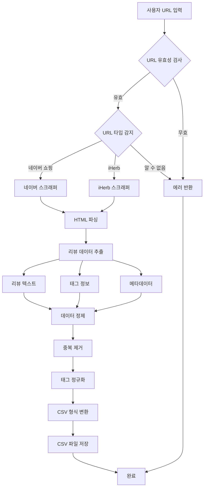
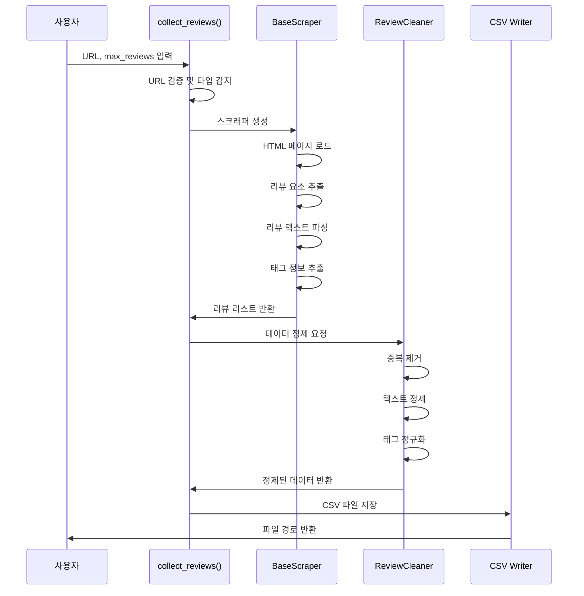

# 팀원 A: 데이터 수집 및 정제 담당 가이드

## 📋 역할 개요

**목표:** "분석할 재료(리뷰 데이터)를 깨끗하게 준비한다."

네이버 쇼핑과 iHerb에서 제품 리뷰를 수집하고, 필요한 메타데이터(재구매 여부, 사용 기간 등)를 추출하여 CSV 형식으로 저장하는 역할을 담당합니다.

---

## 🎯 상세 미션

### 1. 네이버 쇼핑/iHerb URL에서 리뷰 데이터 수집
- URL 입력 받기
- 리뷰 텍스트 추출
- 태그 정보 추출 (재구매, 한달사용)
- 평점, 작성일 등 메타데이터 수집

### 2. 데이터 정제 및 CSV 저장
- 중복 리뷰 제거
- 특수문자 및 불필요한 공백 정리
- 태그 정규화
- CSV 형식으로 저장

---

## 🏗️ 시스템 아키텍처



---

## 📁 파일 구조

```
data_manager/
├── __init__.py              # 패키지 초기화
├── scraper.py               # 메인 스크래퍼 클래스
│   ├── BaseScraper          # 기본 스크래퍼 추상 클래스
│   ├── NaverScraper         # 네이버 쇼핑 스크래퍼
│   └── IHerbScraper         # iHerb 스크래퍼
├── data_cleaner.py          # 데이터 정제 모듈
│   ├── ReviewCleaner        # 리뷰 정제 클래스
│   └── TagNormalizer        # 태그 정규화 클래스
├── utils.py                 # 공통 유틸리티
│   ├── url_validator        # URL 검증 함수
│   ├── url_type_detector    # URL 타입 감지
│   └── error_handler        # 에러 핸들링
└── config.py                # 설정 파일
    ├── SCRAPING_CONFIG      # 스크래핑 설정
    └── DELAY_SETTINGS       # 요청 지연 설정
```

---

## 🔧 기술 스택

- **웹 스크래핑:**
  - `selenium` (4.15.0+): 동적 페이지 처리
  - `beautifulsoup4` (4.12.0+): HTML 파싱
  - `requests` (2.31.0+): HTTP 요청

- **데이터 처리:**
  - `pandas` (2.0.0+): CSV 저장 및 데이터 조작
  - `lxml` (4.9.0+): XML/HTML 파서

- **기타:**
  - `python-dotenv` (1.0.0+): 환경 변수 관리
  - `time`: 요청 지연 처리

---

## 📝 주요 클래스 및 함수 설계

### 1. `scraper.py`

#### `BaseScraper` (추상 클래스)
```python
class BaseScraper:
    """모든 스크래퍼의 기본 클래스"""
    
    def __init__(self, url: str, max_reviews: int = 50):
        """
        Args:
            url: 제품 페이지 URL
            max_reviews: 수집할 최대 리뷰 개수
        """
    
    def scrape(self) -> List[Dict]:
        """리뷰 수집 메인 메서드 (추상)"""
        pass
    
    def _parse_review(self, review_element) -> Dict:
        """개별 리뷰 파싱 (추상)"""
        pass
    
    def _get_review_tags(self, review_element) -> Dict:
        """리뷰 태그 추출 (재구매, 한달사용 등)"""
        pass
```

#### `NaverScraper`
```python
class NaverScraper(BaseScraper):
    """네이버 쇼핑 리뷰 스크래퍼"""
    
    def scrape(self) -> List[Dict]:
        """
        네이버 쇼핑 리뷰 수집
        
        Returns:
            List[Dict]: 리뷰 데이터 리스트
            [
                {
                    'text': '리뷰 텍스트',
                    'rating': 5,
                    'date': '2024-01-15',
                    'reorder': True,      # 재구매 여부
                    'one_month_use': True, # 한달사용 여부
                    'reviewer': '사용자명',
                    'verified': True      # 구매 인증 여부
                },
                ...
            ]
        """
    
    def _parse_review(self, review_element) -> Dict:
        """네이버 쇼핑 리뷰 HTML 파싱"""
    
    def _navigate_pages(self) -> List[WebElement]:
        """페이지네이션 처리"""
    
    def _extract_naver_tags(self, review_element) -> Dict:
        """네이버 쇼핑 태그 추출"""
```

#### `IHerbScraper`
```python
class IHerbScraper(BaseScraper):
    """iHerb 리뷰 스크래퍼"""
    
    def scrape(self) -> List[Dict]:
        """
        iHerb 리뷰 수집
        
        Returns:
            List[Dict]: 리뷰 데이터 리스트
            [
                {
                    'text': '리뷰 텍스트',
                    'rating': 5,
                    'date': '2024-01-15',
                    'reorder': True,
                    'one_month_use': True,
                    'reviewer': '사용자명',
                    'verified': True
                },
                ...
            ]
        """
    
    def _parse_review(self, review_element) -> Dict:
        """iHerb 리뷰 HTML 파싱"""
    
    def _extract_iherb_tags(self, review_element) -> Dict:
        """iHerb 태그 추출"""
```

### 2. `data_cleaner.py`

#### `ReviewCleaner`
```python
class ReviewCleaner:
    """리뷰 데이터 정제 클래스"""
    
    def clean(self, reviews: List[Dict]) -> List[Dict]:
        """
        리뷰 데이터 정제
        
        Args:
            reviews: 원본 리뷰 리스트
        
        Returns:
            List[Dict]: 정제된 리뷰 리스트
        """
    
    def remove_duplicates(self, reviews: List[Dict]) -> List[Dict]:
        """중복 리뷰 제거 (텍스트 기준)"""
    
    def clean_text(self, text: str) -> str:
        """리뷰 텍스트 정제 (특수문자, 공백 처리)"""
    
    def validate_review(self, review: Dict) -> bool:
        """리뷰 유효성 검사"""
```

#### `TagNormalizer`
```python
class TagNormalizer:
    """태그 정규화 클래스"""
    
    def normalize(self, reviews: List[Dict]) -> List[Dict]:
        """
        태그 정보 정규화
        
        - 재구매: True/False로 통일
        - 한달사용: True/False로 통일
        """
    
    def extract_reorder_tag(self, review: Dict) -> bool:
        """재구매 태그 추출 및 정규화"""
    
    def extract_usage_period_tag(self, review: Dict) -> bool:
        """사용 기간 태그 추출 및 정규화"""
```

### 3. `utils.py`

```python
def validate_url(url: str) -> bool:
    """URL 유효성 검사"""
    
def detect_url_type(url: str) -> str:
    """
    URL 타입 감지
    
    Returns:
        'naver' | 'iherb' | 'unknown'
    """
    
def create_scraper(url: str, max_reviews: int = 50) -> BaseScraper:
    """
    URL 타입에 맞는 스크래퍼 생성
    
    Returns:
        NaverScraper | IHerbScraper
    """
    
def handle_scraping_error(error: Exception) -> None:
    """스크래핑 에러 핸들링"""
```

### 4. 메인 함수

```python
def collect_reviews(url: str, max_reviews: int = 50) -> str:
    """
    리뷰 수집 및 CSV 저장 메인 함수
    
    Args:
        url: 제품 페이지 URL
        max_reviews: 수집할 최대 리뷰 개수
    
    Returns:
        str: 저장된 CSV 파일 경로
    """
    # 1. URL 검증 및 타입 감지
    # 2. 스크래퍼 생성
    # 3. 리뷰 수집
    # 4. 데이터 정제
    # 5. CSV 저장
    # 6. 파일 경로 반환
```

---

## 🔄 데이터 흐름



---

## 📊 데이터 구조

### 입력 데이터
- **URL 형식:**
  - 네이버 쇼핑: `https://shopping.naver.com/catalog/...`
  - iHerb: `https://www.iherb.com/pr/...`

### 출력 데이터 (CSV)
```csv
text,rating,date,reorder,one_month_use,reviewer,verified,product_url
"정말 좋은 제품이에요!",5,2024-01-15,True,True,홍길동,True,https://...
"재구매 의사 있습니다",4,2024-01-14,True,False,김철수,True,https://...
...
```

### 리뷰 딕셔너리 구조
```python
{
    'text': str,              # 리뷰 텍스트
    'rating': int,            # 평점 (1-5)
    'date': str,              # 작성일 (YYYY-MM-DD)
    'reorder': bool,          # 재구매 여부
    'one_month_use': bool,    # 한달 이상 사용 여부
    'reviewer': str,          # 리뷰어 이름
    'verified': bool,         # 구매 인증 여부
    'product_url': str,       # 제품 URL
    'review_id': str          # 리뷰 고유 ID (선택)
}
```

---

## 🛠️ 구현 가이드

### 1단계: 기본 스크래퍼 구조 생성

```python
# data_manager/scraper.py
from abc import ABC, abstractmethod
from typing import List, Dict
from selenium import webdriver
from selenium.webdriver.common.by import By
from selenium.webdriver.support.ui import WebDriverWait
from selenium.webdriver.support import expected_conditions as EC

class BaseScraper(ABC):
    def __init__(self, url: str, max_reviews: int = 50):
        self.url = url
        self.max_reviews = max_reviews
        self.driver = None
    
    @abstractmethod
    def scrape(self) -> List[Dict]:
        pass
    
    def _setup_driver(self):
        """Selenium 드라이버 설정"""
        options = webdriver.ChromeOptions()
        options.add_argument('--headless')  # 백그라운드 실행
        options.add_argument('--no-sandbox')
        self.driver = webdriver.Chrome(options=options)
    
    def _close_driver(self):
        """드라이버 종료"""
        if self.driver:
            self.driver.quit()
```

### 2단계: 네이버 쇼핑 스크래퍼 구현

```python
class NaverScraper(BaseScraper):
    def scrape(self) -> List[Dict]:
        """네이버 쇼핑 리뷰 수집"""
        try:
            self._setup_driver()
            self.driver.get(self.url)
            
            reviews = []
            page = 1
            
            while len(reviews) < self.max_reviews:
                # 리뷰 요소 찾기
                review_elements = self.driver.find_elements(
                    By.CSS_SELECTOR, 
                    '.review_list_item'  # 실제 셀렉터는 네이버 구조에 맞게 수정
                )
                
                for element in review_elements:
                    if len(reviews) >= self.max_reviews:
                        break
                    review = self._parse_review(element)
                    if review:
                        reviews.append(review)
                
                # 다음 페이지로 이동
                if not self._go_to_next_page():
                    break
                page += 1
            
            return reviews
        finally:
            self._close_driver()
    
    def _parse_review(self, element) -> Dict:
        """개별 리뷰 파싱"""
        # 실제 네이버 쇼핑 HTML 구조에 맞게 구현
        pass
```

### 3단계: 데이터 정제 모듈 구현

```python
# data_manager/data_cleaner.py
import re
from typing import List, Dict

class ReviewCleaner:
    def clean(self, reviews: List[Dict]) -> List[Dict]:
        """리뷰 데이터 정제"""
        cleaned = []
        seen_texts = set()
        
        for review in reviews:
            # 중복 제거
            text = review.get('text', '').strip()
            if text in seen_texts:
                continue
            seen_texts.add(text)
            
            # 텍스트 정제
            review['text'] = self.clean_text(text)
            
            # 유효성 검사
            if self.validate_review(review):
                cleaned.append(review)
        
        return cleaned
    
    def clean_text(self, text: str) -> str:
        """텍스트 정제"""
        # 불필요한 공백 제거
        text = re.sub(r'\s+', ' ', text)
        # 특수문자 정리 (필요시)
        return text.strip()
    
    def validate_review(self, review: Dict) -> bool:
        """리뷰 유효성 검사"""
        return (
            review.get('text') and 
            len(review.get('text', '')) > 10 and  # 최소 길이
            review.get('rating') is not None
        )
```

### 4단계: CSV 저장 기능

```python
# data_manager/data_cleaner.py
import pandas as pd
from datetime import datetime

def save_to_csv(reviews: List[Dict], filename: str = None) -> str:
    """
    리뷰를 CSV 파일로 저장
    
    Args:
        reviews: 리뷰 리스트
        filename: 저장할 파일명 (없으면 자동 생성)
    
    Returns:
        str: 저장된 파일 경로
    """
    if not filename:
        timestamp = datetime.now().strftime('%Y%m%d_%H%M%S')
        filename = f'data/reviews/reviews_{timestamp}.csv'
    
    df = pd.DataFrame(reviews)
    df.to_csv(filename, index=False, encoding='utf-8-sig')
    
    return filename
```

---

## ⚠️ 주의사항 및 베스트 프랙티스

### 1. 웹 스크래핑 윤리
- **로봇 배제 표준 준수:** `robots.txt` 확인
- **요청 지연:** 서버 부하 방지를 위해 요청 간 지연 시간 설정
- **User-Agent 설정:** 정상적인 브라우저로 인식되도록 설정

### 2. 에러 핸들링
- 네트워크 오류 처리
- 페이지 구조 변경 대응
- 타임아웃 설정

### 3. 성능 최적화
- 헤드리스 모드 사용 (필요시)
- 불필요한 리소스 로딩 방지
- 배치 처리

### 4. 데이터 품질
- 최소 리뷰 길이 검증
- 평점 범위 검증
- 날짜 형식 통일

---

## 🧪 테스트 예시

```python
# tests/test_scraper.py
from data_manager.scraper import NaverScraper, IHerbScraper
from data_manager.utils import detect_url_type

def test_naver_scraper():
    url = "https://shopping.naver.com/catalog/..."
    scraper = NaverScraper(url, max_reviews=10)
    reviews = scraper.scrape()
    
    assert len(reviews) > 0
    assert 'text' in reviews[0]
    assert 'rating' in reviews[0]

def test_url_detection():
    naver_url = "https://shopping.naver.com/..."
    iherb_url = "https://www.iherb.com/pr/..."
    
    assert detect_url_type(naver_url) == 'naver'
    assert detect_url_type(iherb_url) == 'iherb'
```

---

## 📚 참고 자료

- [Selenium 공식 문서](https://www.selenium.dev/documentation/)
- [BeautifulSoup 문서](https://www.crummy.com/software/BeautifulSoup/bs4/doc/)
- [Pandas CSV 처리](https://pandas.pydata.org/docs/reference/api/pandas.DataFrame.to_csv.html)

---

## ✅ 체크리스트

- [ ] BaseScraper 추상 클래스 구현
- [ ] NaverScraper 구현 및 테스트
- [ ] IHerbScraper 구현 및 테스트
- [ ] ReviewCleaner 구현
- [ ] TagNormalizer 구현
- [ ] CSV 저장 기능 구현
- [ ] 에러 핸들링 추가
- [ ] 로깅 기능 추가
- [ ] 단위 테스트 작성

