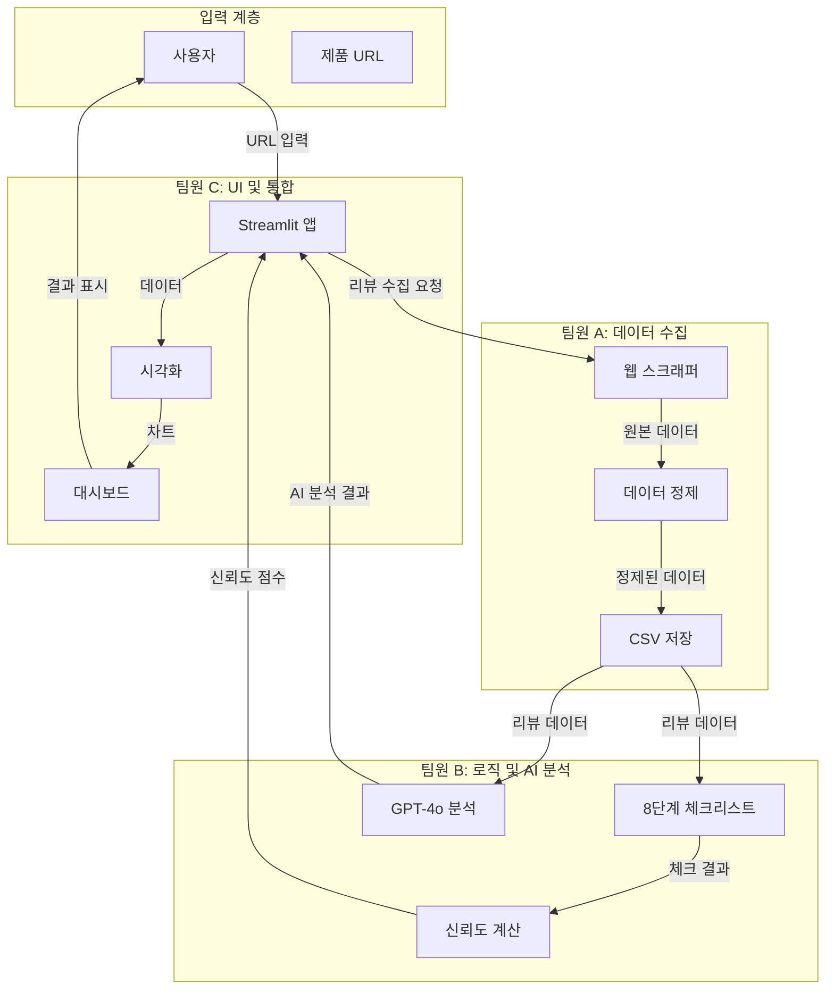
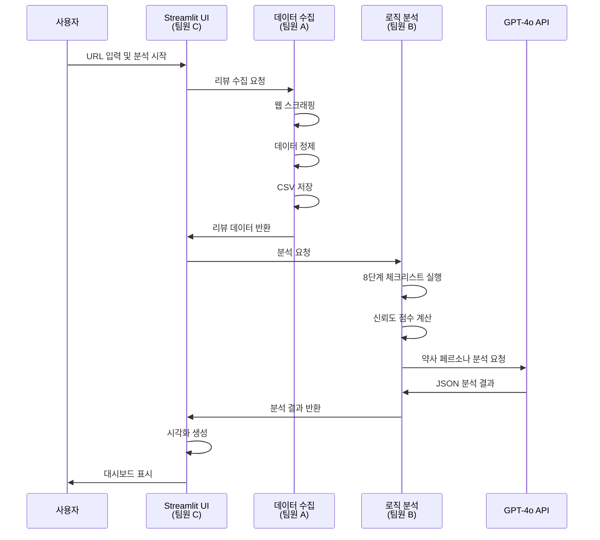

# 건기식 리뷰 팩트체크 시스템 - 전체 프로젝트 개요

## 📖 프로젝트 소개

건기식 제품의 온라인 리뷰를 수집하고, AI를 활용하여 광고성 리뷰를 판별하며, 약사의 시각으로 분석 결과를 제공하는 웹 서비스입니다.

---

## 👥 팀 구성 및 역할

### 팀원 A: 데이터 수집 및 정제 담당 (Data Manager)
- **목표:** 분석할 재료(리뷰 데이터)를 깨끗하게 준비
- **상세 가이드:** [팀원A_데이터수집_정제_가이드.md](팀원A_데이터수집_정제_가이드.md)

### 팀원 B: 로직 설계 및 AI 분석 담당 (Logic Designer)
- **목표:** 리뷰의 진위여부를 가리고, 약사의 시각으로 요약
- **상세 가이드:** [팀원B_로직설계_AI분석_가이드.md](팀원B_로직설계_AI분석_가이드.md)

### 팀원 C: 화면 구현 및 통합 담당 (UI & Integration)
- **목표:** 결과물을 멋진 웹 대시보드로 보여주기
- **상세 가이드:** [팀원C_화면구현_통합_가이드.md](팀원C_화면구현_통합_가이드.md)

---

## 🏗️ 전체 시스템 아키텍처



---

## 📂 프로젝트 구조

```
개발2팀 과제/
├── docs/                          # 문서 디렉토리
│   ├── 프로젝트_전체_개요.md
│   ├── 팀원A_데이터수집_정제_가이드.md
│   ├── 팀원B_로직설계_AI분석_가이드.md
│   └── 팀원C_화면구현_통합_가이드.md
├── data_manager/                  # 팀원 A 작업
│   ├── __init__.py
│   ├── scraper.py
│   ├── data_cleaner.py
│   └── utils.py
├── logic_designer/                 # 팀원 B 작업
│   ├── __init__.py
│   ├── checklist.py
│   ├── trust_score.py
│   ├── ai_analyzer.py
│   └── config.py
├── ui_integration/                 # 팀원 C 작업
│   ├── __init__.py
│   ├── app.py
│   ├── components.py
│   └── visualizations.py
├── data/                           # 데이터 저장소
│   └── reviews/                    # 수집된 리뷰 CSV
├── tests/                          # 테스트 코드
│   ├── test_scraper.py
│   ├── test_checklist.py
│   └── test_ui.py
├── requirements.txt                # Python 패키지 의존성
├── .env.example                    # 환경 변수 예시
├── README.md                       # 프로젝트 설명서
└── preview.html                    # UI 프리뷰
```

---

## 🔄 전체 워크플로우



---

## 📊 데이터 흐름

```mermaid
flowchart LR
    A[원본 리뷰<br/>HTML] -->|스크래핑| B[리뷰 딕셔너리<br/>List[Dict]]
    B -->|정제| C[정제된 리뷰<br/>CSV]
    C -->|체크리스트| D[체크 결과<br/>Dict]
    C -->|메타데이터| E[재구매율<br/>사용기간]
    D -->|가중치 적용| F[체크리스트 점수<br/>float]
    F -->|공식 적용| G[신뢰도 점수<br/>0-100]
    E -->|공식 적용| G
    C -->|프롬프트 생성| H[GPT-4o 요청]
    H -->|JSON 응답| I[AI 분석 결과<br/>Dict]
    G -->|시각화| J[게이지 차트]
    I -->|시각화| K[약사 인사이트]
    G -->|시각화| L[비교 테이블]
    I -->|시각화| L
```

---

## 🛠️ 기술 스택 요약

### 공통
- **Python 3.8+**
- **pandas**: 데이터 처리
- **python-dotenv**: 환경 변수 관리

### 팀원 A
- **selenium**: 동적 웹 스크래핑
- **beautifulsoup4**: HTML 파싱
- **requests**: HTTP 요청

### 팀원 B
- **openai**: GPT-4o API
- **re**: 정규표현식 (내장)
- **collections**: 텍스트 통계 (내장)

### 팀원 C
- **streamlit**: 웹 앱 프레임워크
- **plotly**: 인터랙티브 차트

---

## 📋 개발 단계별 체크리스트

### 1주차: 팀원 A 작업
- [ ] BaseScraper 추상 클래스 구현
- [ ] NaverScraper 구현
- [ ] IHerbScraper 구현
- [ ] ReviewCleaner 구현
- [ ] CSV 저장 기능 구현
- [ ] 단위 테스트 작성

### 2주차: 팀원 B 작업
- [ ] AdPatternChecker 클래스 구현
- [ ] 8단계 체크리스트 모두 구현 (기획서 반영)
- [ ] ChecklistScorer 구현
- [ ] TrustScoreCalculator 구현
- [ ] 신뢰도 공식 구현 (기획서 반영)
- [ ] PharmacistAnalyzer 구현
- [ ] GPT-4o API 연동
- [ ] 단위 테스트 작성

### 3주차: 팀원 C 작업
- [ ] Streamlit 기본 앱 구조
- [ ] 사이드바 UI 구현
- [ ] 메인 화면 레이아웃 구현
- [ ] 팀원 A 모듈 통합
- [ ] 팀원 B 모듈 통합
- [ ] 시각화 컴포넌트 구현
- [ ] 3종 비교 기능 구현

### 4주차: 통합 및 테스트
- [ ] 전체 워크플로우 테스트
- [ ] 에러 핸들링 추가
- [ ] UI/UX 개선
- [ ] 성능 최적화
- [ ] 문서화 완료

---

## 🔌 모듈 간 인터페이스

### 팀원 A → 팀원 B
```python
# 팀원 A 출력 형식
reviews: List[Dict] = [
    {
        'text': str,
        'rating': int,
        'date': str,
        'reorder': bool,
        'one_month_use': bool,
        'reviewer': str,
        'verified': bool,
        'product_url': str
    },
    ...
]

# 팀원 B 입력 형식
# 동일한 형식 사용
```

### 팀원 B → 팀원 C
```python
# 팀원 B 출력 형식
analysis_result: Dict = {
    'trust_score': float,        # 0 ~ 100
    'trust_level': str,           # 'high' | 'medium' | 'low'
    'checklist_results': Dict,     # 체크리스트 상세 결과
    'ai_result': {
        'summary': str,
        'efficacy': List[str],
        'side_effects': List[str],
        'recommendations': str,
        'trust_assessment': str,
        'warnings': List[str]
    }
}

# 팀원 C 입력 형식
# 동일한 형식 사용
```

---

## ⚙️ 환경 설정

### 1. Python 가상환경 생성
```bash
python -m venv venv
source venv/bin/activate  # Windows: venv\Scripts\activate
```

### 2. 패키지 설치
```bash
pip install -r requirements.txt
```

### 3. 환경 변수 설정
```bash
cp .env.example .env
# .env 파일에 OPENAI_API_KEY 설정
```

### 4. 실행
```bash
# 팀원 C: Streamlit 앱 실행
streamlit run ui_integration/app.py
```

---

## 📝 requirements.txt

```
# 웹 프레임워크
streamlit>=1.28.0

# 데이터 처리
pandas>=2.0.0
numpy>=1.24.0

# 웹 스크래핑 (팀원 A)
selenium>=4.15.0
beautifulsoup4>=4.12.0
requests>=2.31.0
lxml>=4.9.0

# AI 분석 (팀원 B)
openai>=1.3.0

# 시각화 (팀원 C)
plotly>=5.17.0
matplotlib>=3.7.0

# 기타
python-dotenv>=1.0.0
```

---

## 🧪 테스트 전략

### 단위 테스트
- 각 모듈별 독립 테스트
- Mock 객체 활용

### 통합 테스트
- 모듈 간 연동 테스트
- 전체 워크플로우 테스트

### 사용자 테스트
- 실제 URL로 테스트
- 다양한 시나리오 테스트

---

## ⚠️ 주의사항

### 1. 웹 스크래핑 윤리
- robots.txt 준수
- 요청 지연 시간 설정
- 서버 부하 최소화

### 2. API 키 보안
- 환경 변수로 관리
- 코드에 하드코딩 금지
- Git에 커밋 금지

### 3. 데이터 개인정보
- 리뷰어 정보 익명화 고려
- 개인정보 보호 준수

### 4. 에러 핸들링
- 모든 모듈에 예외 처리
- 사용자 친화적 에러 메시지
- 로깅 기능 추가

---

## 📚 참고 문서

- [팀원 A 가이드](팀원A_데이터수집_정제_가이드.md)
- [팀원 B 가이드](팀원B_로직설계_AI분석_가이드.md)
- [팀원 C 가이드](팀원C_화면구현_통합_가이드.md)

---

## 🎯 최종 목표

1. **정확한 데이터 수집**: 네이버 쇼핑/iHerb에서 리뷰를 안정적으로 수집
2. **신뢰할 수 있는 분석**: 8단계 체크리스트와 AI 분석으로 정확한 판별
3. **직관적인 시각화**: 사용자가 쉽게 이해할 수 있는 대시보드
4. **확장 가능한 구조**: 향후 기능 추가가 용이한 모듈화된 구조

---

## 📞 협업 가이드

### Git 브랜치 전략
- `main`: 메인 브랜치
- `feature/team-a-*`: 팀원 A 기능
- `feature/team-b-*`: 팀원 B 기능
- `feature/team-c-*`: 팀원 C 기능

### 코드 리뷰
- 각 팀원의 PR은 다른 팀원이 리뷰
- 통합 전 반드시 테스트

### 커뮤니케이션
- 인터페이스 변경 시 사전 협의
- 데이터 형식 변경 시 문서 업데이트

